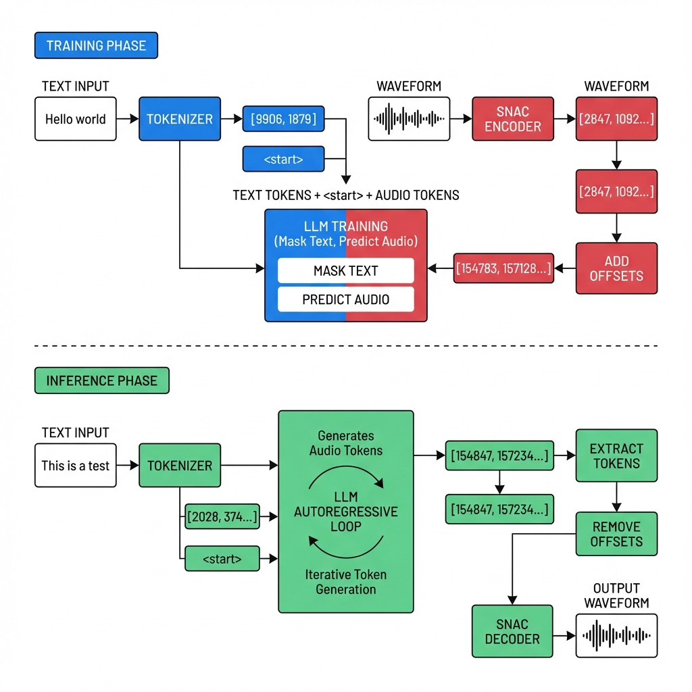

# Blueprint for Building Autoregressive TTS


TTS stands for text to speech. It takes in text, generates intelligible speech from it. Autoregressive TTS has become very popular lately and we are seeing lots and lots of new TTS with good quality every day. Maya1, NuoTTS-Air, Orpheus, the list is long. But have you ever wondered how they are trained? Well, that's what we'll be doing here in this article. We will train a model to generate audio. Consider this as a blueprint for training autoregressive Text-to-Speech models. Our goal is to have an intuition-first understanding of the process.

Autoregressive TTS are essentially LLM models that are trained on generating audio tokens. Those tokens are converted (decoded) back to audio using a neural audio codec. Before we go in-depth into how it works, let's spend a bit on getting an intuitive understanding of what a token is.

## Token, what is even that?

In its very original form, tokens are just some numbers. That's all it is.

When you type "hello world" into ChatGPT, the model doesn't actually see the words "hello" and "world". It sees numbers. Maybe `[15339, 1879]`. A tokenizer converts (encodes) your text into tokens, i.e., numbers that the model understands. And after processing, it again generates its response in numbers, which later gets converted (detokenized) back to words again for us, dumb humans.

We train an LLM to generate these numbers, or more accurately predict these numbers. Like given a sequence of tokens, what likely token comes next in that sequence, so on and so forth. The LLM learns this through training. We tell it what tokens to generate through training.

Since everything an LLM sees (even the instruction for what the LLM is supposed to do) is tokens, can we not just teach the LLM to generate tokens that when converted (decoded) make sounds? That's the whole idea of auto-regressive TTS. We teach the LLM to generate audio tokens. That's all we do.

## Tokenizer

Since it's all about tokens, we need a system that knows which token stands for which word. A tokenizer does exactly that. It knows what's the token for cat and what's the token for dog, and it can convert words to tokens, and tokens to words consistently. BERT, GPT, Llama, and all variants have their own tokenizer. Tokenizers are specialized to do the conversion on a set of vocabulary that they are given, but they(vocabularies) are flexible to extension.

## Audio Tokenization

Text and audio tokens both are essentially numbers, but most generally used tokenizers don't know audio tokens out of the box. We use a special system (neural audio codec - encoder/decoder) for that. DAC, SNAC, and NuoCodec are some of the popular audio codecs that are used for TTS training. For this specific article, we will be exploring SNAC, which powers many of the current popular TTS models.

### SNAC

Audio tokenizer i.e., codec models (neural encoder/decoder) takes audio and gives out token representation (discrete codes) of that audio. Each codec has its own pattern that it produces its tokens into and expects the same pattern to be maintained to generate (decode) audio back from it. Understanding the pattern is the most important part of the TTS training. This is where you'll be spending most of your energy. Once you've got it sorted, all you do is just sit back and wait for the training to finish. Kidding, there's a lot you have to do, but this is one major part that needs to be sorted.

Anyway, SNAC takes audio (through its encoder) and gives you layers of token representations. It has 3 layers in total, and understanding this is kinda important.

So here's how it works. Instead of giving you one number per audio frame, SNAC gives you multiple numbers arranged in 3 layers. Think of it like describing a photo at different levels of detail:

- **Layer 0 :** "It's a cat" - just the basic stuff
- **Layer 1 :** "It's an orange tabby cat" - getting more specific
- **Layer 2 :** "It's an orange tabby cat with green eyes and a white patch" - all the fine details

SNAC does the exact same thing for audio:
- **Layer 0 (1 token per frame):** What phoneme is this? Is the pitch high or low?
- **Layer 1 (2 tokens per frame):** What does the speaker sound like? Male or female voice?
- **Layer 2 (4 tokens per frame):** What's the breathiness? Any background noise? The tiny details.

So for each audio frame, you get **7 total tokens**. 1 from Layer 0, 2 from Layer 1, and 4 from Layer 2. That's 7 numbers representing about 40ms of audio.

Here's what it looks like for one frame:
```
Audio frame: "ah" sound (40ms of audio)
Layer 0: [2847]                    # phoneme + pitch
Layer 1: [1092, 3856]              # speaker characteristics
Layer 2: [457, 2901, 3345, 1823]   # fine details

All together: [2847, 1092, 3856, 457, 2901, 3345, 1823]
```

Each layer uses a codebook of 4096 possible values (0-4095). The encoder just looks up the closest match in its codebook and returns that number (code index). That's why it's called **vector quantization** (VQ), some fancy name for "lookup table".

### Flattening the Hierarchy

Now, as we previously mentioned, the LLM is designed to predict the next token in a sequence; therefore, we need to somehow convert this complex time-interval 3-layered, hierarchical structure of audio codes to a flat sequence. We need a system that can take SNAC encoded output and convert (flatten) it to a 1D sequence of tokens and take a 1D sequence of tokens and reconstruct (unflatten) it to the SNAC decoder's expected 3-layer structure. Here is a common pattern variant used by many TTS models currently.

Now here's the problem. LLMs need a flat, 1D sequence. Like `[1, 2, 3, 4, 5, 6, 7, 8, ...]`. But SNAC gives us hierarchical codes in 3 separate layers. So we need to flatten this mess.

We do this by following a simple pattern. For each frame, we arrange the 7 tokens in order:
```
Frame 0: [c0_0, c1_0, c1_1, c2_0, c2_1, c2_2, c2_3]
Frame 1: [c0_1, c1_2, c1_3, c2_4, c2_5, c2_6, c2_7]
Frame 2: [c0_2, c1_4, c1_5, c2_8, c2_9, c2_10, c2_11]
```

Every 7 tokens = 1 audio frame. That's it. Simple pattern. And since it's deterministic, we can reverse it during inference.

Here's what the unflattening looks like conceptually:
```python
def unflatten(tokens):
    c0, c1, c2 = [], [], []
    i = 0
    while i + 6 < len(tokens):
        frame = tokens[i:i+7]  # Take 7 tokens
        c0.append(frame[0] - SNAC_OFFSET)  # First token → Layer 0
        c1.extend([frame[1] - SNAC_OFFSET - 4096, frame[2] - SNAC_OFFSET - 4096])  # Next 2 → Layer 1
        c2.extend([t - SNAC_OFFSET - 8192 for t in frame[3:]])  # Last 4 → Layer 2
        i += 7
    return [c0, c1, c2]
```

The actual implementation follows later in this article.

### Putting It Together

As I was screaming earlier, the LLM will predict the next token when you give it a sequence. So for TTS, the sequence we give it is the tokenized version of the text we want to generate speech for.

Let me show you what "Hello world" actually looks like:
```
Text tokens:  [9906, 1879]            # "Hello world" tokenized (Qwen tokenizer)
Audio start:  [164224]                # <|audio_start|> special token
Audio tokens: [154783, 157128, 159952, ...] # the actual flattened audio tokens
Audio end:    [164225]                # <|audio_end|> special token

Combined:
[9906, 1879, 164224, 154783, 157128, 159952, 160049, 162997, 163441, 163919, ..., 164225]
 └─text─┘  └start┘ └────────────────audio tokens────────────────────┘  └─end─┘
```

Note: Audio token IDs start from 151936 onwards (SNAC Layer 0: 151936-156031, Layer 1: 156032-160127, Layer 2: 160128-164223), and special tokens are at 164224-164225.

But the model can't do this out of the box. We have to teach it. We have to tell it: "Hey, when you see these text tokens, you should generate these audio tokens."

## Dataset Preparation

The way it is done is, in the dataset, we concatenate both text tokens and audio tokens, and during the training we teach the model that given these tokens (text tokens), it should generate the following tokens (audio tokens). Lets break it down into steps.

### Step-by-Step Process

So how do we actually do this? Let me walk you through the process:

**1. Load the text tokenizer**

First, we load our text tokenizer (Qwen2.5 in our case):
```python
tokenizer = AutoTokenizer.from_pretrained("Qwen/Qwen2.5-0.5B")
```

**2. Extend the vocabulary**

Then we add all those SNAC tokens to the vocabulary. Remember, we need 4096 tokens for each of the 3 layers, plus 2 special tokens:
```python
new_tokens = [f"<snac_l{l}_{i}>" for l in range(3) for i in range(4096)] + ["<|audio_start|>", "<|audio_end|>"]
tokenizer.add_tokens(new_tokens)  # 12,290 new tokens added
```

**3. Load the audio codec**

Now we load SNAC:
```python
snac_model = SNAC.from_pretrained("hubertsiuzdak/snac_24khz").cuda().eval()
```

**4. Encode audio files**

For each audio file in our dataset, we encode it to SNAC tokens and flatten it:
```python
def encode_7_per_frame(wav_path):
    # Load and resample to 24kHz if needed
    audio, sr = sf.read(wav_path)
    if sr != 24000:
        audio = librosa.resample(audio, orig_sr=sr, target_sr=24000)
    
    # Encode with SNAC (encoder)
    audio = torch.from_numpy(audio).unsqueeze(0).unsqueeze(0).float().cuda()
    with torch.no_grad():
        codes = snac_model.encode(audio)  # Returns hierarchical codes [c0, c1, c2]
    
    # Flatten it using our 7-per-frame pattern
    c0, c1, c2 = [c.squeeze(0).squeeze(-1) for c in codes]
    base_offset = len(tokenizer) - 12290
    flat = []
    for i in range(len(c0)):
        flat.append(base_offset + 0*4096 + c0[i].item())
        flat.append(base_offset + 1*4096 + c1[2*i].item())
        flat.append(base_offset + 1*4096 + c1[2*i+1].item())
        for j in range(4):
            flat.append(base_offset + 2*4096 + c2[4*i+j].item())
    return flat
```

**5. Concatenate text and audio**

Then we concatenate everything together:
```python
text_ids = tokenizer.encode("Your text here")
snac_tokens = encode_7_per_frame("audio.wav")
start_id = tokenizer.convert_tokens_to_ids("<|audio_start|>")
end_id = tokenizer.convert_tokens_to_ids("<|audio_end|>")

input_ids = text_ids + [start_id] + snac_tokens + [end_id]
```

**6. Mask the text portion**

And here's the important part - we mask the text portion. We don't want the model to predict text from text (it already knows that). We only want it to learn to predict audio tokens:
```python
labels = [-100] * (len(text_ids) + 1) + snac_tokens + [end_id]
```

That `-100` is a special value that tells PyTorch to ignore those positions during loss calculation.

You do this for every single audio-text pair in your dataset. You need a LOT of audio data. The better your data, the better your results. We use the LJSpeech dataset which is ~24 hours of clean English speech with 13,100 clips.

## Training

Once we have the dataset, we can get to work. There's a lot of hyper parameters that can be tuned to get the perfect results.

### The Training Process

Once you have the dataset ready, training is actually pretty straightforward. It's just causal language modeling, like training any other LLM, with a few tweaks.

**Load the base model**

First, load your base model:
```python
model = AutoModelForCausalLM.from_pretrained("Qwen/Qwen2.5-0.5B")
model.resize_token_embeddings(len(tokenizer))  # Don't forget this! We added ~12,290 tokens
```

**Setup optimizer (Optional - can use defaults)**

Then setup your optimizer. I use AdamW with some custom settings:
```python
optimizer = torch.optim.AdamW(
    model.parameters(),
    lr=5e-5,
    betas=(0.95, 0.90), 
    eps=1e-7,
    weight_decay=0.01
)
```

**Learning rate schedule (Optional)**

I also use a cosine learning rate schedule with warmup. Sounds fancy, but it just means the learning rate starts low, goes up, then gradually decreases:
```python
def lr_decay_lambda(step):
    if step < warmup_steps:
        return float(step) / float(max(1, warmup_steps))
    progress = float(step - warmup_steps) / float(max(1, max_steps - warmup_steps))
    return max(0.1, 0.5 * (1.0 + math.cos(math.pi * progress)))

scheduler = LambdaLR(optimizer, lr_lambda=lr_decay_lambda)
```

**Training configuration**

Setup your training arguments:
```python
args = TrainingArguments(
    output_dir="./qwen-snac-tts",
    per_device_train_batch_size=6,
    gradient_accumulation_steps=8,  # Effective batch size = 48
    learning_rate=5e-5,
    max_steps=200,  # This is just for demo. Use 15000+ for real results
    bf16=True,  # Much faster than fp32
    eval_strategy="steps",
    eval_steps=10,
    save_steps=10,
    logging_steps=1,
    report_to="wandb",  # I love watching those graphs go down
)
```

**Run training**

And then just... train:
```python
trainer = Trainer(
    model=model,
    args=args,
    train_dataset=train_ds,
    eval_dataset=eval_ds,
    data_collator=collate_fn,
    optimizers=(optimizer, scheduler)
)

trainer.train()
```

That's it. Now you wait. And wait. And wait some more.

### Hyperparameters to Tweak

A few things you might want to tweak:
- **Learning rate**: 5e-5 works well for me, but you can try anywhere from 1e-5 to 1e-4
- **Max steps**: More steps usually means better quality, but watch out for overfitting
- **Gradient accumulation**: If your GPU is screaming for mercy, increase this
- **Temperature** (for inference): Controls how random the generation is. 0.7-0.9 gives natural-sounding speech
- **Top-p** (for inference): Another sampling parameter. 0.9 is a good default

## Inference

So, once we have a model that is trained to generate audio tokens, we can finally generate speech from it. Remember how we wrote a function to transform (unflatten) a sequence of audio tokens to SNAC-specific 3 layers? We will be using exactly that here. So we will generate token IDs from the LLM, extract the sequences of audio tokens (remember we taught the LLM to differentiate between text and audio tokens and put the audio tokens between `<|audio_start|>` and `<|audio_end|>`). Once converted (unflattened) to SNAC-appropriate data (hierarchical codes), we use the decoder to get the audio waveform, which we can play and verify.

### Advanced Techniques

Now, there's a lot of different techniques to produce better quality and consistent audio. Different annotation techniques are used such as:
- **Speaker annotation**: Adding a speaker signature in the training data so when we use the same signature, the model generates audio tokens that match that speaker's voice
- **Instruction tuning**: Instead of a signature, adds instructions like what should be the emotion and tone

As long as we have lots of examples to back each of these patterns, the model will learn it and will be able to reproduce them during inference.

## Related Projects

If you want to check out other people's implementations, here are some popular TTS projects that follow similar ideas:

- **[Maya1](https://huggingface.co/maya-research/maya1)** - 3B parameters, uses SNAC, and supports 20+ emotions (laugh, cry, whisper, rage, etc)
- **[Orpheus](https://github.com/canopyai/Orpheus-TTS)** - 3B parameters, Super clean implementation. A lot of this pipeline is inspired by Orpheus actually
- **[NeuTTS Air](https://huggingface.co/neuphonic/NeuTTS-Air)** - Uses in-house NeuCodec audio codec, and a Qwen backbone, can clone voices from just 3 seconds of audio
- **[Moshi](https://github.com/kyutai-labs/moshi)** - Uses Mimi audio codec. It can listen and speak at the same time with ~200ms latency. Perfect for conversational AI
- **[Bark](https://github.com/suno-ai/bark)** - Uses EnCodec audio codec, one of the first of it's kind, supports multiple languages and emotions.

## Acknowledgements

Shoutout to the projects and datasets that made this possible:
- **[Orpheus](https://github.com/canopyai/Orpheus-TTS)** - For the training methodology and that clever flattening pattern
- **[Qwen2.5](https://github.com/QwenLM/Qwen2.5)** - The base LLM we use
- **[SNAC](https://github.com/hubertsiuzdak/snac)** - The audio codec that makes all of this work
- **[Ray](https://github.com/ray-project/ray)** - For distributed training
- **[LJSpeech](https://keithito.com/LJ-Speech-Dataset/)** - Free, clean dataset
